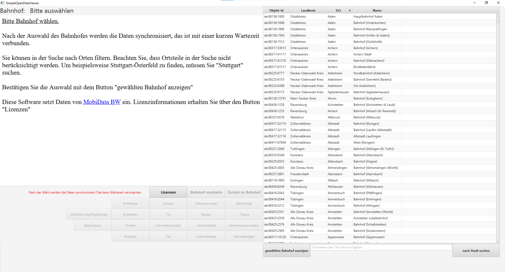
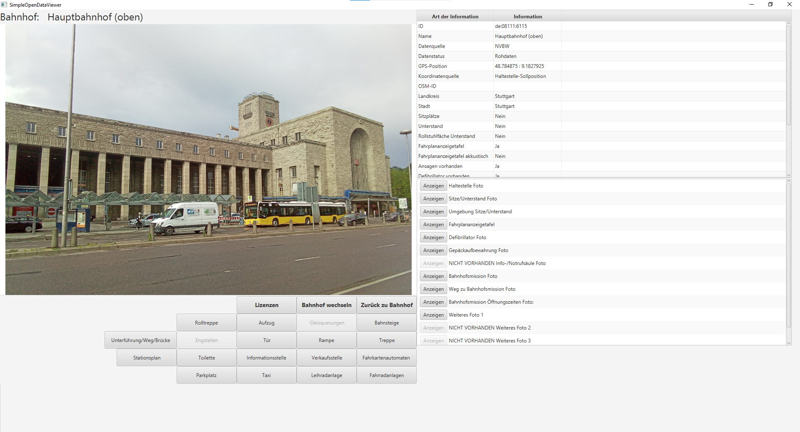
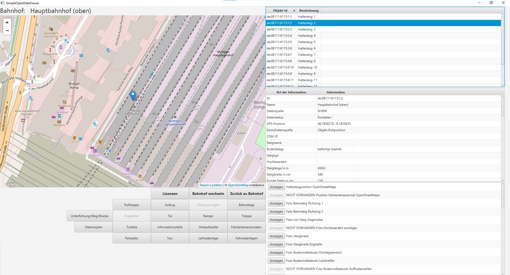
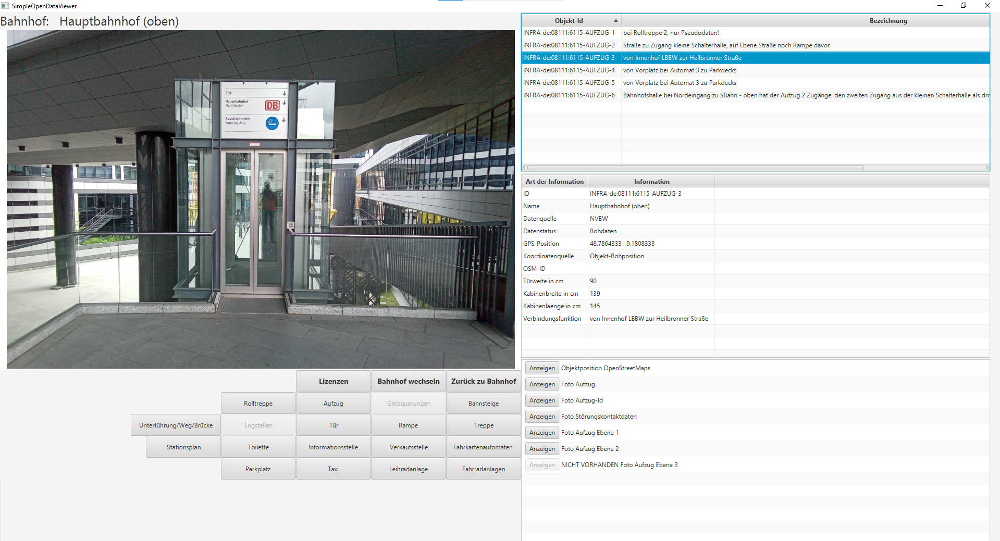
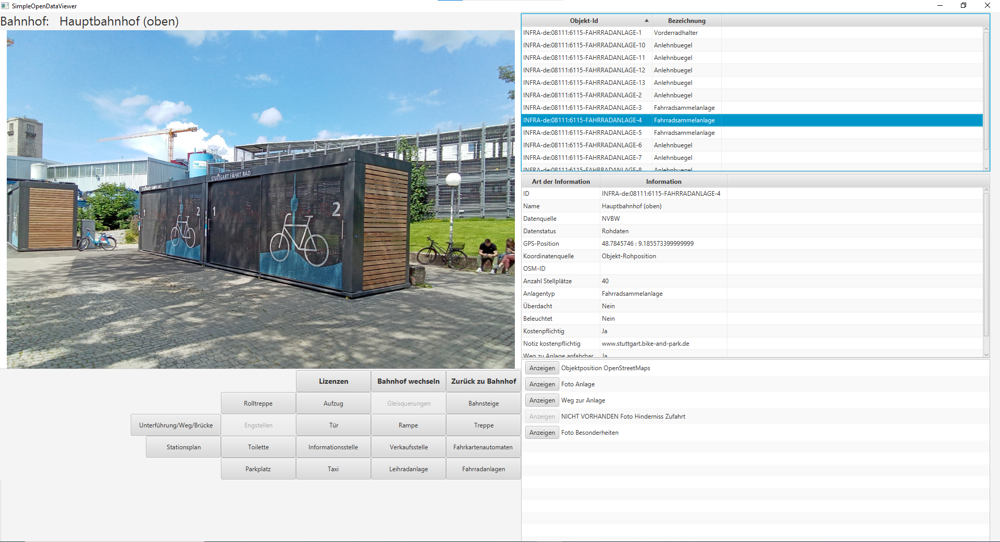

# SimpleOpenDataViewerFx
A Simple Viewer for Dataset "bfrk-barrierefreiheit-an-bw-bahnhoefen" from MobiDataBW/NVBW

Sie wollen als Bahnnutzer ìn Baden-Württemberg sehen, wie der Bahnhof an Ihrem Zielort aussieht? Sie sind vielleicht in der Mobilität
eingeschränkt und auf einen Aufzug und einen stufenfreien Zugang angewiesen? Oder Sie interessieren sich als Bahnfan für Bahnhöfe? 
Sind Sie sogar Mitarbeiter der Bahn oder eines Verkehrsverbundes und wollen kurz nachschauen, wie jeder einzelne Bahnhof
aussieht? Oder Sie sind Pendler und wollen wissen, wo Sie ihr Fahrrad oder ihr Auto abstellen können? Oder wo Sie
unterwegs an ein Leihrad kommen?

Auf MobiDataBW existiert dafür ein vollständiger Datensatz, dieser liegt aber in Tabellenform als CSV-Datei vor, und ist 
für interessierte Menschen, die ihn kurz anschauen wollen, nur eingeschränkt geeignet. Diese Daten müssen also für den
Menschen aufbereitet und gefiltert werden.

Bei der Software "SimpleOpenDataViewerFx" handelt es sich um eine Software, die den Datensatz "Barrierefreiheit an BW-Bahnhöfen" 
(https://www.mobidata-bw.de/dataset/bfrk-barrierefreiheit-an-bw-bahnhoefen) von "MobiData BW" herunterlädt und diesen visualisiert.

Die Daten werden bei jedem Start der Software neu synchronisiert und die Bilder werden bei Bedarf nachgeladen, die Software ist also 
auf eine dauerhafte Onlineverbindung angewiesen. Die Daten werden direkt von "MobiDataBW" heruntergeladen, es werden keine zusätzlichen
Server oder Clouddienste eingesetzt.

Für Windows wird ein ZIP-File mit allen erforderlichen Librarys zur Verfügung gestellt, auf anderen Betriebssystemen sollte die
bereitgestellte jar-Datei ebenfalls einsetzbar sein. Das ist aber im Moment noch nicht getestet. Es wird Java in der Version 17 benötigt.

Link zu Windows-Paket: https://github.com/hkirn/SimpleOpenDataViewerFx/releases/

Aktuelle JAR können Sie direkt von der Build-Pipeline herunterladen: https://github.com/hkirn/SimpleOpenDataViewerFx/actions/workflows/maven.yml

Nach dem Start den benötigten Bahnhof auswählen, in der Suchfunktion können Sie nach Ortsnamen filtern. Bitte hierbei beachten, dass
die Suchfunktion wirklich nur Ortsnamen berücksichtigt, statt z.B. "Österfeld" müssen Sie "Stuttgart" suchen.
Nach der Auswahl des ersten Orts führt "OpenDataViewerFx" eine komplette Synchronisation der Daten durch, es werden ca. 2MB heruntergeladen
und in eine nutzbare Datenstruktur umgewandelt. Dieser Vorgang kann je nach Bandbreite und Rechenleistung ca. 5-20 Sekunden dauern.

Nach erfolgreicher Synchronisation können Sie mit den Buttons auf der linken Seite die benötigten Informationen auswählen. Auf der rechten
Seite werden die Daten dargestellt. Je nach Auswahl sind mehrere Bilder und GPS-Positionen verfügbar.

Bitte beachten Sie, dass der Datensatz im Moment nicht zu jedem Bahnhof Bilder enthält. Die Software zeigt Ihnen dann eine Karte von
OpenStreetMaps mit der Position des gewählten Objekts an.

Diese Software und der genutzte Datensatz können Fehler enthalten. Ich möchte darauf hinweisen, dass ich keinerlei Haftung übernehme.
Diese Software ist noch in einem sehr frühen Stadium, es können noch Fehler vorhanden sein!

Für mich ist das ganze eher ein Lernprojekt, da ich mich gerade zum Softwareentwickler weiter bilde. Diese Software kann
selbstverständlich auch angepasst werden, es wäre beispielsweise eine Version speziell für Radfahrer möglich, die nur 
B+R und Leihradanlagen enthält.

Da diese Software komplett in Java entwickelt ist, wäre ein Großteil des Codes auch für Android nutzbar.

Bei Fragen können Sie mich unter sodw@kirn-net.de erreichen.

Bitte beachten Sie zusätzlich die Lizenzinformationen über die verwendeten Daten: 
https://htmlpreview.github.io/?https://github.com/hkirn/SimpleOpenDataViewerFx/blob/main/src/main/resources/license.html

Screenshots:

